# TÀI LIỆU HƯỚNG DẪN SỬ DỤNG HỆ THỐNG QUẢN TRỊ WINLINE VIETNAM

> **Dành cho:** Ban Giám Đốc, Bộ phận Kế toán bán hàng, Kỹ sư kỹ thuật HVAC & Quản trị viên Website
> **Dự án:** winlinevn073.mbws.vn (Winline Core E-commerce & HVAC Calculation Engine)
> **Phiên bản:** v1.0.0 (Release 2026) | Ngôn ngữ: 100% Tiếng Việt
> **File PDF bàn giao in ấn:** `docs/Huong_Dan_Su_Dung_Admin_Winline.pdf`

---

## MỤC LỤC CHI TIẾT (17 CHƯƠNG TOÀN DIỆN)

1. [Giới thiệu & Đăng nhập Bảo mật](#chuong-1-intro) - *TỔNG QUAN (OVERVIEW)*
2. [Bảng Điều Khiển & Thống Kê Kinh Doanh (Dashboard)](#chuong-2-dashboard-view) - *TỔNG QUAN (OVERVIEW)*
3. [Phân Quyền & Quản Lý Thành Viên (Users & Roles)](#chuong-3-user-roles) - *TÀI KHOẢN & PHÂN QUYỀN*
4. [Quản Lý Sản Phẩm Quạt Công Nghiệp (HVAC Products)](#chuong-4-catalog-products) - *QUẢN LÝ DANH MỤC & THIẾT BỊ*
5. [Bảng Ma Trận So Sánh Thông Số Model (Comparison Table)](#chuong-5-model-matrix) - *QUẢN LÝ DANH MỤC & THIẾT BỊ*
6. [Quản Lý & Xử Lý Đơn Hàng (Orders Processing)](#chuong-6-order-management) - *BÁN HÀNG & THƯƠNG MẠI*
7. [Báo Giá Kỹ Thuật & Yêu Cầu Dự Án (RFQ & Contacts)](#chuong-7-rfq-leads) - *BÁN HÀNG & THƯƠNG MẠI*
8. [Bài Viết Kỹ Thuật & Chuẩn SEO (Posts & SEO)](#chuong-8-cms-posts) - *NỘI DUNG & TRUYỀN THÔNG*
9. [Mã Giảm Giá & Chiết Khấu Thầu (Vouchers)](#chuong-9-promotions-vouchers) - *BÁN HÀNG & THƯƠNG MẠI*
10. [Kiểm Duyệt Đánh Giá Sản Phẩm (Reviews Moderation)](#chuong-10-reviews-moderation) - *NỘI DUNG & TRUYỀN THÔNG*
11. [Quản Lý Banner & Chiến Dịch Hình Ảnh (Banners)](#chuong-11-banners-sliders) - *GIAO DIỆN & TRẢI NGHIỆM*
12. [Quản Lý Menu Điều Hướng Website (Navigation Menus)](#chuong-12-menus-navigation) - *GIAO DIỆN & TRẢI NGHIỆM*
13. [Thư Viện File & Tài Liệu Bản Vẽ PDF (Media Library)](#chuong-13-media-manager) - *NỘI DUNG & TRUYỀN THÔNG*
14. [Cài Đặt Hệ Thống & Cờ Tính Năng (System Settings)](#chuong-14-settings-core) - *CẤU HÌNH & HỆ THỐNG*
15. [Quản Lý Đa Ngôn Ngữ (Localization & Languages)](#chuong-15-languages-locales) - *CẤU HÌNH & HỆ THỐNG*
16. [Nhật Ký Kiểm Toán & Truy Vết Bảo Mật (Activity Logs)](#chuong-16-audit-logs) - *CẤU HÌNH & HỆ THỐNG*
17. [Công Cụ Tính Toán Lưu Lượng Quạt Storefront (HVAC Calculator)](#chuong-17-hvac-calculator) - *CÔNG CỤ KỸ THUẬT HVAC*

---

## CHƯƠNG 1: GIỚI THIỆU & ĐĂNG NHẬP BẢO MẬT

**Phân loại:** `TỔNG QUAN (OVERVIEW)` | **Đặc tả nhãn:** `explanation`

**Mô tả tổng quan:** Hướng dẫn đăng nhập hệ thống quản trị Winline an toàn và cơ chế bảo vệ phiên làm việc chống tấn công dò quét mật khẩu (brute-force).

### 1. Quy trình thao tác chuẩn từng bước
1. Mở trình duyệt web (Google Chrome, Microsoft Edge hoặc Safari) và truy cập đường dẫn: `http://winline.vn/vi/admin/login`.
2. Nhập chính xác Email quản trị viên và Mật khẩu tài khoản được cấp.
3. Tích chọn 'Ghi nhớ đăng nhập' nếu sử dụng thiết bị cá nhân an toàn.
4. Bấm nút 'Đăng nhập' để truy cập vào trung tâm điều hành quản trị Winline.

### 2. Giao diện thực tế & Khoanh vùng chức năng (Screenshots)
> 🌐 **Đường dẫn màn hình:** `https://winline.vn/vi/admin/login`

### 3. Bảng tra cứu hành động & Ký hiệu thao tác
| Ký hiệu | Khu vực / Tên trường | Hướng dẫn thao tác & Lưu ý nghiệp vụ |
| :---: | :--- | :--- |
| **①** | **Ô nhập Email quản trị** | Nhập tài khoản email quản trị viên đã được tạo trên hệ thống (VD: `winlinevietnam@gmail.com`). Tài khoản phải có trạng thái hoạt động (`is_active = 1`). |
| **②** | **Ô nhập Mật khẩu bảo mật** | Nhập mật khẩu tương ứng. Hệ thống tích hợp nút con mắt cho phép ẩn/hiện mật khẩu để kiểm tra độ chính xác trước khi bấm gửi. |
| **③** | **Ghi nhớ đăng nhập** | Tích chọn để lưu phiên đăng nhập trong vòng 30 ngày, tránh việc phải đăng nhập lại nhiều lần khi đóng mở trình duyệt. |
| **④** | **Nút Đăng nhập & Rate Limiting** | Gửi dữ liệu xác thực qua giao thức mã hóa. Hệ thống tích hợp bộ lọc bảo mật tự động khóa IP 60 giây nếu đăng nhập sai quá 5 lần liên tiếp. |

### 4. Lưu ý nghiệp vụ quan trọng
- 💡 **Lưu ý bảo mật mật khẩu:** Mật khẩu quản trị cần có tối thiểu 8 ký tự, bao gồm chữ hoa, chữ thường, chữ số và ký tự đặc biệt. Tuyệt đối không chia sẻ tài khoản dùng chung.
- 💡 **Cơ chế phân quyền:** Chỉ những tài khoản được gán vai trò có quyền truy cập trang quản trị mới được phép vào hệ thống. Các tài khoản khách hàng thông thường sẽ bị từ chối truy cập.

---

## CHƯƠNG 2: BẢNG ĐIỀU KHIỂN & THỐNG KÊ KINH DOANH (DASHBOARD)

**Phân loại:** `TỔNG QUAN (OVERVIEW)` | **Đặc tả nhãn:** `overview`

**Mô tả tổng quan:** Trung tâm chỉ huy hiển thị các chỉ số kinh doanh cốt lõi: doanh thu ngày/tháng, số lượng đơn hàng mới, sản phẩm bán chạy và yêu cầu báo giá kỹ thuật dự án chờ duyệt.

### 1. Quy trình thao tác chuẩn từng bước
1. Sau khi đăng nhập, hệ thống sẽ tự động chuyển hướng về trang Bảng điều khiển (Dashboard).
2. Quan sát nhanh 4 thẻ thống kê trên cùng để nắm bắt hiệu quả bán hàng tức thời.
3. Theo dõi danh sách các đơn hàng và yêu cầu báo giá gần nhất cần xử lý trong ngày.

### 2. Giao diện thực tế & Khoanh vùng chức năng (Screenshots)
> 🌐 **Đường dẫn màn hình:** `https://winline.vn/vi/admin`
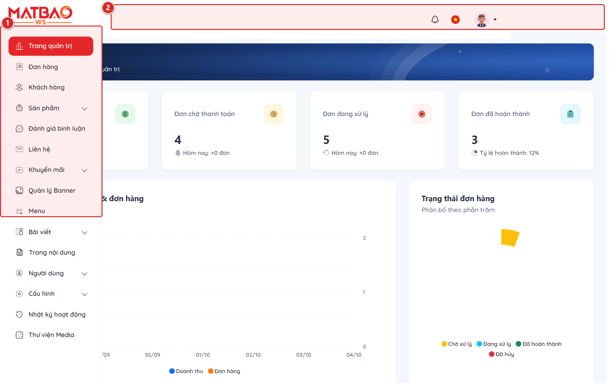

### 3. Bảng tra cứu hành động & Ký hiệu thao tác
| Ký hiệu | Khu vực / Tên trường | Hướng dẫn thao tác & Lưu ý nghiệp vụ |
| :---: | :--- | :--- |
| **①** | **Menu điều hướng nghiệp vụ (Sidebar)** | Thanh menu dọc bên trái được phân nhóm khoa học: Tổng quan, Danh mục quạt, Đơn hàng, Yêu cầu báo giá, Bài viết kỹ thuật, Banner, Cài đặt hệ thống. |
| **②** | **Thanh công cụ trên cùng (Top Header)** | Chứa ô tìm kiếm nhanh toàn hệ thống, công tắc chuyển đổi ngôn ngữ (Tiếng Việt/English), chuông thông báo đơn mới và menu tài khoản cá nhân. |
| **③** | **Thẻ chỉ số tổng quan (KPI Metric Cards)** | Hiển thị dữ liệu thực tế về Doanh thu tổng, Đơn hàng mới, Thiết bị đang kinh doanh và Khách hàng đã đăng ký. |

### 4. Lưu ý nghiệp vụ quan trọng
- 💡 **Cập nhật dữ liệu thời gian thực:** Các chỉ số doanh thu và đơn hàng được tính toán trực tiếp từ cơ sở dữ liệu. Khi có đơn hàng mới từ website, chuông thông báo trên thanh header sẽ phát tín hiệu.

---

## CHƯƠNG 3: PHÂN QUYỀN & QUẢN LÝ THÀNH VIÊN (USERS & ROLES)

**Phân loại:** `TÀI KHOẢN & PHÂN QUYỀN` | **Đặc tả nhãn:** `administration`

**Mô tả tổng quan:** Quản lý danh sách nhân sự vận hành website, phân chia vai trò rõ ràng (Superadmin, Kế toán, Kỹ thuật viên HVAC, Biên tập viên) và thiết lập quyền hạn chi tiết.

### 1. Quy trình thao tác chuẩn từng bước
1. Truy cập menu 'Hệ thống' &rarr; 'Thành viên' (Users).
2. Bấm 'Thêm thành viên' để tạo tài khoản mới cho nhân viên hoặc bấm icon 'Sửa' tại dòng tài khoản cần phân quyền.
3. Chọn vai trò tương ứng và bật/tắt công tắc trạng thái kích hoạt.

### 2. Giao diện thực tế & Khoanh vùng chức năng (Screenshots)
> 🌐 **Đường dẫn màn hình:** `https://winline.vn/vi/admin/users/1/edit`
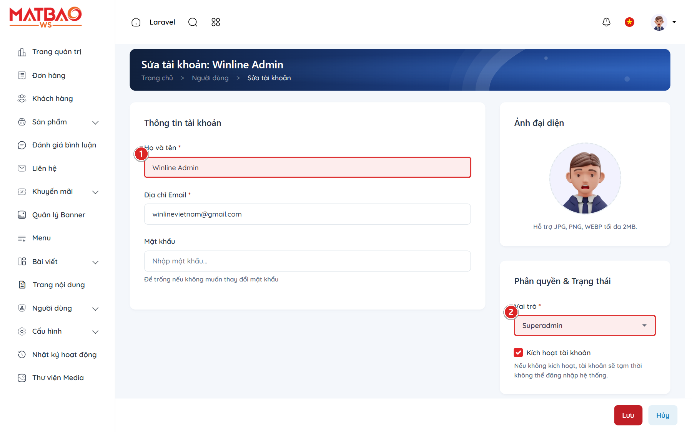

### 3. Bảng tra cứu hành động & Ký hiệu thao tác
| Ký hiệu | Khu vực / Tên trường | Hướng dẫn thao tác & Lưu ý nghiệp vụ |
| :---: | :--- | :--- |
| **①** | **Thông tin tài khoản thành viên** | Bao gồm Họ tên hiển thị và Email đăng nhập của nhân viên phụ trách. |
| **②** | **Vai trò phân quyền (Role Dropdown)** | Lựa chọn vai trò phù hợp: Superadmin (Toàn quyền), Quản trị viên kinh doanh, Kỹ sư HVAC, Kế toán xử lý đơn hàng, Biên tập viên nội dung. |
| **③** | **Công tắc Kích hoạt / Khóa tài khoản** | Bật (Active) để cho phép đăng nhập. Gạt sang Tắt (Inactive) để vô hiệu hóa tài khoản ngay lập tức khi nhân viên nghỉ việc mà không làm mất lịch sử thao tác. |
| **④** | **Nút Lưu cập nhật** | Lưu toàn bộ thay đổi thông tin và quyền hạn vào hệ thống cơ sở dữ liệu. |

### 4. Lưu ý nghiệp vụ quan trọng
- 💡 **Nguyên tắc bảo mật phân quyền:** Chỉ cấp quyền vừa đủ theo đúng vị trí công việc. Tránh cấp quyền Superadmin cho nhiều nhân viên để phòng tránh rủi ro thay đổi cấu hình lõi hệ thống.

---

## CHƯƠNG 4: QUẢN LÝ SẢN PHẨM QUẠT CÔNG NGHIỆP (HVAC PRODUCTS)

**Phân loại:** `QUẢN LÝ DANH MỤC & THIẾT BỊ` | **Đặc tả nhãn:** `hvac core`

**Mô tả tổng quan:** Quản lý cơ sở dữ liệu quạt công nghiệp Winline với đầy đủ các trường thông số kỹ thuật HVAC chuyên sâu phục vụ thiết kế cơ điện và công cụ tính toán tự động.

### 1. Quy trình thao tác chuẩn từng bước
1. Truy cập menu 'Sản phẩm' &rarr; 'Tất cả sản phẩm'.
2. Bấm nút 'Tạo sản phẩm mới' hoặc bấm vào tên sản phẩm để mở giao diện chỉnh sửa thông số.
3. Nhập thông tin cơ bản: Tên sản phẩm, Mã SKU, Danh mục quạt, Thương hiệu và Giá bán.
4. Nhập các chỉ số kỹ thuật quạt chuyên dụng tại khối thuộc tính HVAC.
5. Tải lên hình ảnh sản phẩm độ phân giải cao và file Catalog/Bản vẽ kỹ thuật PDF.

### 2. Giao diện thực tế & Khoanh vùng chức năng (Screenshots)
> 🌐 **Đường dẫn màn hình:** `https://winline.vn/vi/admin/products/1/edit`
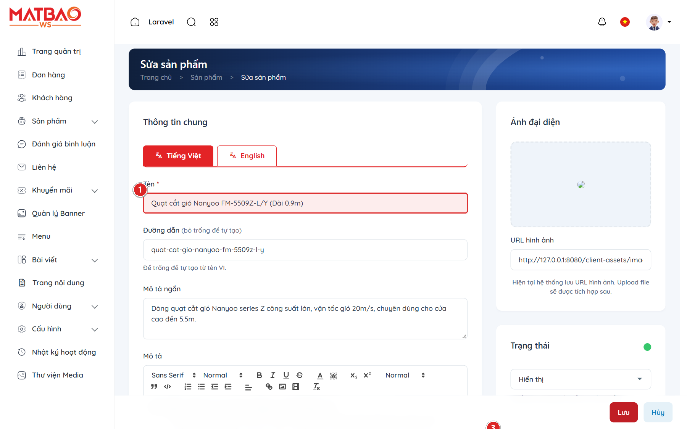

### 3. Bảng tra cứu hành động & Ký hiệu thao tác
| Ký hiệu | Khu vực / Tên trường | Hướng dẫn thao tác & Lưu ý nghiệp vụ |
| :---: | :--- | :--- |
| **①** | **Tên sản phẩm thương mại** | Đặt tên quạt theo chuẩn ngành kỹ thuật (VD: `Quạt ly tâm hút khói PCCC Nanyoo YNF-3.5A`) để tối ưu công cụ tìm kiếm. |
| **②** | **Mã SKU quản lý kho** | Mã định danh duy nhất cho từng model sản phẩm (VD: `NY-YNF3.5A-2.2KW`). |
| **③** | **Khối thông số kỹ thuật HVAC** | Nhập các thông số kỹ thuật trọng yếu: Lưu lượng gió ($m^3/h$), Cột áp tĩnh ($Pa$), Công suất điện ($kW$), Điện áp ($220V/380V$), Độ ồn ($dB$), Đường kính cánh ($mm$). |
| **④** | **Nút Lưu sản phẩm** | Lưu cập nhật và tự động đồng bộ sang công cụ tính quạt tự động ngoài storefront. |

### 4. Lưu ý nghiệp vụ quan trọng
- 💡 **Dữ liệu nguồn cho công cụ tính quạt:** Khối thông số HVAC là linh hồn của website Winline. Các trường Lưu lượng ($m^3/h$) và Cột áp ($Pa$) bắt buộc phải nhập đúng số học để thuật toán tính toán quạt ngoài website có thể lọc chính xác model phù hợp cho kỹ sư thiết kế.

---

## CHƯƠNG 5: BẢNG MA TRẬN SO SÁNH THÔNG SỐ MODEL (COMPARISON TABLE)

**Phân loại:** `QUẢN LÝ DANH MỤC & THIẾT BỊ` | **Đặc tả nhãn:** `matrix table`

**Mô tả tổng quan:** Tính năng độc quyền cho phép dựng bảng so sánh thông số nhiều model quạt trong cùng một series (Điện áp, Công suất, Lưu lượng, Cân nặng, Kích thước) hiển thị dạng ma trận trực quan ngoài website.

### 1. Quy trình thao tác chuẩn từng bước
1. Truy cập menu 'Sản phẩm' &rarr; 'Bảng so sánh model' (Model Comparison Tables).
2. Bấm 'Thêm bảng mới' hoặc bấm chỉnh sửa bảng đã tạo.
3. Nhập tên bảng nội bộ và tiêu đề hiển thị cho khách hàng xem.
4. Cấu hình danh sách các cột thông số kỹ thuật cần đối chiếu.
5. Thêm các dòng model tương ứng và nhập thông số cho từng ô ma trận.

### 2. Giao diện thực tế & Khoanh vùng chức năng (Screenshots)
> 🌐 **Đường dẫn màn hình:** `https://winline.vn/vi/admin/model-tables/1/edit`
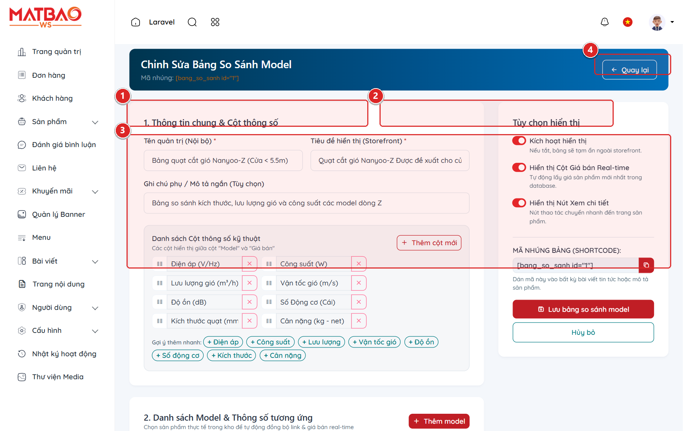

### 3. Bảng tra cứu hành động & Ký hiệu thao tác
| Ký hiệu | Khu vực / Tên trường | Hướng dẫn thao tác & Lưu ý nghiệp vụ |
| :---: | :--- | :--- |
| **①** | **Tên quản trị nội bộ** | Tên nhận diện bảng trong danh sách quản lý (VD: `Bảng quạt cắt gió Nanyoo-Z`). |
| **②** | **Tiêu đề storefront** | Tiêu đề nổi bật hiển thị trên giao diện người dùng (VD: `Quạt cắt gió Nanyoo-Z Được đề xuất cho cửa cao dưới 5.5m`). |
| **③** | **Ma trận đối chiếu thông số** | Lưới bảng nhập liệu động gồm các cột kỹ thuật và các dòng model. Cho phép thêm model, sắp xếp thứ tự và gắn link sản phẩm trực tiếp. |
| **④** | **Nút Lưu cấu hình bảng** | Lưu và xuất bản ma trận thông số ra các trang sản phẩm liên quan. |

### 4. Lưu ý nghiệp vụ quan trọng
- 💡 **Hiển thị tương thích di động:** Bảng ma trận model tự động hỗ trợ thanh cuộn ngang mượt mà trên điện thoại và máy tính bảng, đảm bảo kỹ sư công trình xem đầy đủ bảng thông số mọi lúc mọi nơi.

---

## CHƯƠNG 6: QUẢN LÝ & XỬ LÝ ĐƠN HÀNG (ORDERS PROCESSING)

**Phân loại:** `BÁN HÀNG & THƯƠNG MẠI` | **Đặc tả nhãn:** `e-commerce`

**Mô tả tổng quan:** Quy trình theo dõi và cập nhật vòng đời đơn hàng quạt công nghiệp từ khi khách đặt trên website đến khi xuất kho, giao hàng đến công trình và quyết toán.

### 1. Quy trình thao tác chuẩn từng bước
1. Truy cập menu 'Bán hàng' &rarr; 'Đơn hàng' (Orders).
2. Sử dụng các tab bộ lọc trạng thái để phân loại đơn: Chờ xử lý, Đang giao hàng, Đã hoàn tất, Đã hủy.
3. Bấm vào mã đơn hàng để mở trang chi tiết đơn.
4. Kiểm tra danh sách thiết bị quạt, địa chỉ công trình và số tiền thanh toán.
5. Cập nhật trạng thái đơn hàng tương ứng với tiến độ thực tế.

### 2. Giao diện thực tế & Khoanh vùng chức năng (Screenshots)
> 🌐 **Đường dẫn màn hình:** `https://winline.vn/vi/admin/orders`
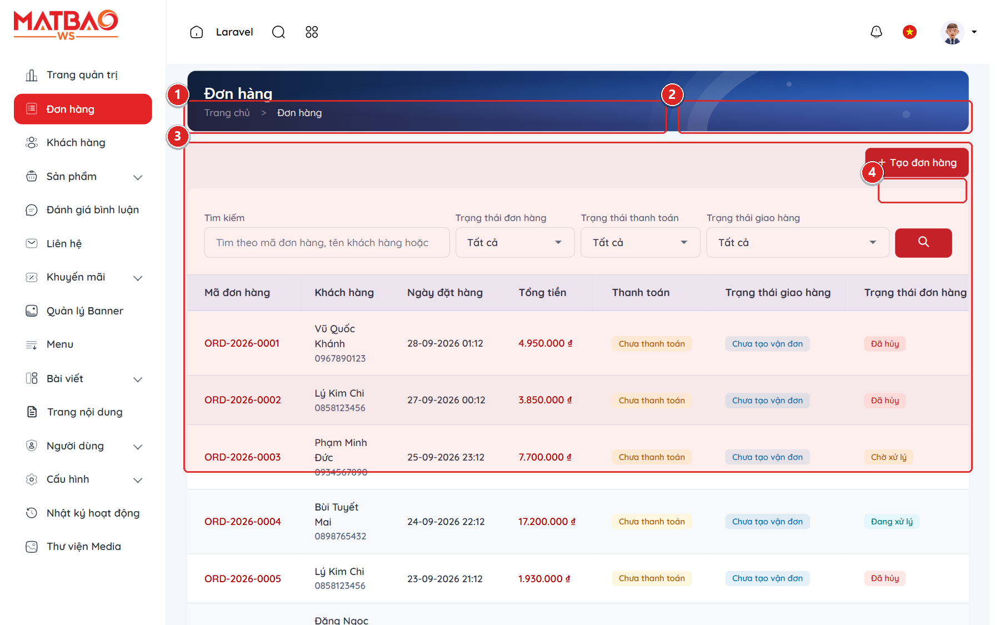

### 3. Bảng tra cứu hành động & Ký hiệu thao tác
| Ký hiệu | Khu vực / Tên trường | Hướng dẫn thao tác & Lưu ý nghiệp vụ |
| :---: | :--- | :--- |
| **①** | **Bộ lọc trạng thái đơn hàng** | Các tab lọc nhanh: Tất cả đơn, Chờ xử lý (đơn mới cần xác nhận), Đang vận chuyển (đã bàn giao đơn vị vận tải), Hoàn tất và Đã hủy. |
| **②** | **Ô tìm kiếm nhanh** | Tìm kiếm chính xác đơn hàng theo Mã đơn (VD: `#ORD-2026-001`), Tên người mua, Số điện thoại hoặc Email. |
| **③** | **Bảng danh sách đơn hàng** | Hiển thị tổng quan: Mã đơn, Thời gian tạo, Tên khách hàng & dự án, Tổng tiền thanh toán, Trạng thái thanh toán và Phương thức vận chuyển. |
| **④** | **Nút Thao tác / Xem chi tiết** | Mở hồ sơ chi tiết đơn hàng để in phiếu xuất kho, liên hệ khách hàng hoặc điều chỉnh trạng thái đơn. |

### 4. Lưu ý nghiệp vụ quan trọng
- 💡 **Email thông báo tự động:** Mỗi khi quản trị viên cập nhật trạng thái đơn hàng (VD: từ Chờ xử lý sang Đang giao), hệ thống sẽ tự động gửi email thông báo trạng thái kèm mã vận đơn đến khách hàng.

---

## CHƯƠNG 7: BÁO GIÁ KỸ THUẬT & YÊU CẦU DỰ ÁN (RFQ & CONTACTS)

**Phân loại:** `BÁN HÀNG & THƯƠNG MẠI` | **Đặc tả nhãn:** `rfq engine`

**Mô tả tổng quan:** Quản lý phễu khách hàng dự án MEP, nhà thầu xây dựng và kỹ sư cơ điện gửi yêu cầu báo giá khối lượng lớn (Request for Quotation - RFQ) từ website.

### 1. Quy trình thao tác chuẩn từng bước
1. Truy cập menu 'Khách hàng' &rarr; 'Yêu cầu liên hệ / RFQ' (Contact Submissions).
2. Lọc các yêu cầu có nhãn 'Báo giá kỹ thuật (RFQ)'.
3. Mở xem chi tiết thông tin dự án, số lượng quạt, thông số công trình yêu cầu.
4. Liên hệ khách hàng qua điện thoại/Zalo và cập nhật trạng thái đã phản hồi báo giá.

### 2. Giao diện thực tế & Khoanh vùng chức năng (Screenshots)
> 🌐 **Đường dẫn màn hình:** `https://winline.vn/vi/admin/contact-submissions`
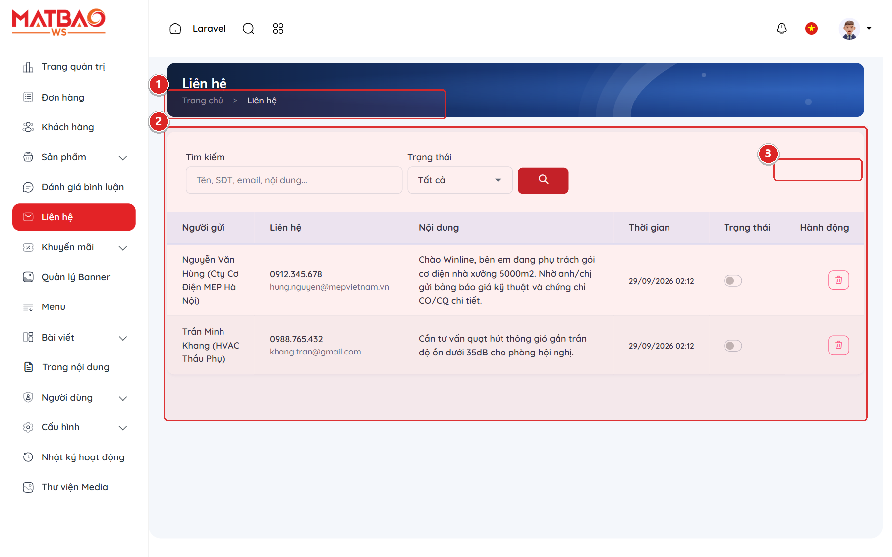

### 3. Bảng tra cứu hành động & Ký hiệu thao tác
| Ký hiệu | Khu vực / Tên trường | Hướng dẫn thao tác & Lưu ý nghiệp vụ |
| :---: | :--- | :--- |
| **①** | **Bộ lọc loại yêu cầu** | Phân loại nhanh giữa Yêu cầu báo giá kỹ thuật dự án (RFQ), Liên hệ tư vấn sản phẩm và Yêu cầu bảo hành kỹ thuật. |
| **②** | **Bảng tiếp nhận thông tin nhà thầu** | Hiển thị Tên người liên hệ, Đơn vị/Công ty, Số điện thoại, Email, Model quạt quan tâm và Nội dung ghi chú kỹ thuật. |
| **③** | **Nút Xem & Xử lý yêu cầu** | Mở modal chi tiết để xem toàn văn yêu cầu, tải tệp đính kèm (bản vẽ/BOQ) và đổi trạng thái: Mới &rarr; Đang xử lý &rarr; Đã báo giá. |

### 4. Lưu ý nghiệp vụ quan trọng
- 💡 **Thời gian vàng phản hồi RFQ:** Trong ngành thiết bị cơ điện HVAC, phản hồi yêu cầu báo giá trong vòng 30 - 60 phút đầu tiên giúp tăng tỷ lệ chốt đơn thầu lên đến 75%. Quản trị viên nên kiểm tra mục RFQ thường xuyên.

---

## CHƯƠNG 8: BÀI VIẾT KỸ THUẬT & CHUẨN SEO (POSTS & SEO)

**Phân loại:** `NỘI DUNG & TRUYỀN THÔNG` | **Đặc tả nhãn:** `seo & cms`

**Mô tả tổng quan:** Hệ thống biên tập tin tức, bài viết cẩm nang kỹ thuật HVAC và tối ưu hóa chuẩn SEO Onpage nhằm gia tăng thứ hạng tìm kiếm trên Google cho thương hiệu Winline.

### 1. Quy trình thao tác chuẩn từng bước
1. Truy cập menu 'Bài viết' &rarr; 'Thêm bài viết mới'.
2. Nhập Tiêu đề bài viết kỹ thuật và chọn Chuyên mục phù hợp.
3. Soạn thảo nội dung trong trình soạn thảo Rich Text (chèn hình ảnh, định dạng tiêu đề H2, H3).
4. Cấu hình các thẻ Meta SEO: Meta Title, Meta Description và Từ khóa trọng tâm.
5. Bấm 'Xuất bản' để đưa bài viết lên website.

### 2. Giao diện thực tế & Khoanh vùng chức năng (Screenshots)
> 🌐 **Đường dẫn màn hình:** `https://winline.vn/vi/admin/posts/1/edit`
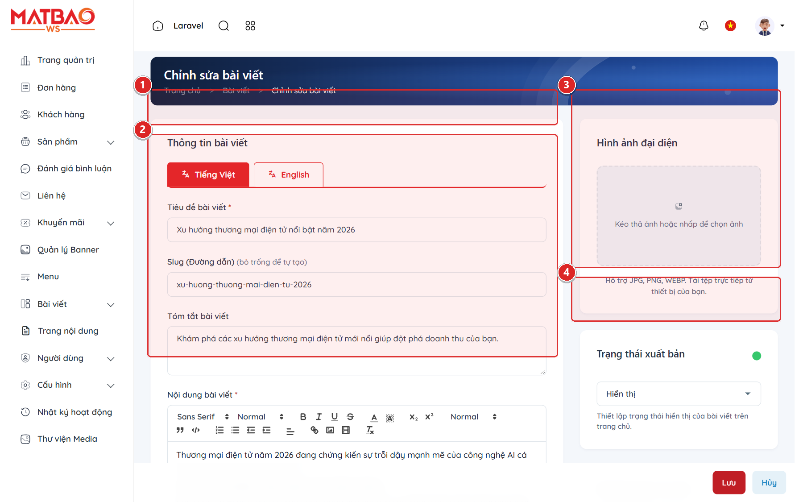

### 3. Bảng tra cứu hành động & Ký hiệu thao tác
| Ký hiệu | Khu vực / Tên trường | Hướng dẫn thao tác & Lưu ý nghiệp vụ |
| :---: | :--- | :--- |
| **①** | **Tiêu đề bài viết kỹ thuật** | Tiêu đề bài viết rõ ràng, chứa từ khóa chuyên môn (VD: `Hướng dẫn tính toán chọn quạt thông gió nhà xưởng theo TCVN`). |
| **②** | **Trình soạn thảo nội dung kỹ thuật** | Bộ soạn thảo đầy đủ tính năng: định dạng văn bản, chèn ảnh sắc nét, bảng biểu thông số và video minh họa lắp đặt. |
| **③** | **Khung cấu hình chuẩn SEO Google** | Bộ đo lường SEO Onpage: Thẻ Meta Title (khuyên dùng 50-60 ký tự), Meta Description (khuyên dùng 150-160 ký tự) và khung xem trước kết quả tìm kiếm Google (SERP Preview). |
| **④** | **Nút Xuất bản / Lưu nháp** | Lưu bài viết dưới dạng Bản nháp để rà soát hoặc Xuất bản trực tiếp lên website. |

### 4. Lưu ý nghiệp vụ quan trọng
- 💡 **Tự động tạo Schema JSON-LD:** Hệ thống Winline tự động sinh cấu trúc dữ liệu Schema Article/BlogPosting giúp Google hiểu rõ tác giả, ngày đăng và chuyên mục bài viết.

---

## CHƯƠNG 9: MÃ GIẢM GIÁ & CHIẾT KHẤU THẦU (VOUCHERS)

**Phân loại:** `BÁN HÀNG & THƯƠNG MẠI` | **Đặc tả nhãn:** `marketing`

**Mô tả tổng quan:** Tạo các chương trình khuyến mãi, mã voucher giảm giá phần trăm hoặc số tiền cố định cho khách hàng dự án và khách mua hàng online.

### 1. Quy trình thao tác chuẩn từng bước
1. Truy cập menu 'Khuyến mãi' &rarr; 'Mã giảm giá' (Vouchers).
2. Bấm nút 'Tạo voucher mới'.
3. Thiết lập Mã code, Loại giảm giá (% hoặc số tiền), Hạn mức đơn hàng tối thiểu và Thời hạn hiệu lực.
4. Bấm 'Lưu' để kích hoạt chương trình khuyến mãi.

### 2. Giao diện thực tế & Khoanh vùng chức năng (Screenshots)
> 🌐 **Đường dẫn màn hình:** `https://winline.vn/vi/admin/vouchers`
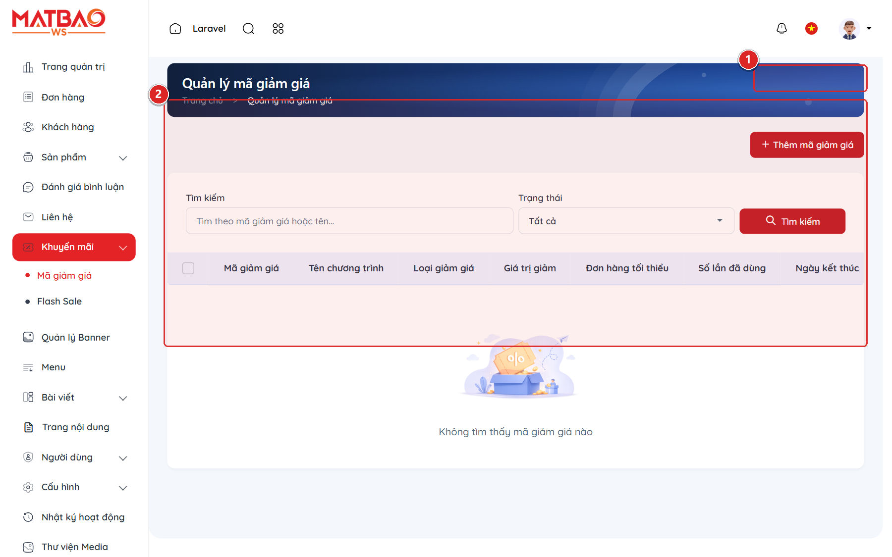

### 3. Bảng tra cứu hành động & Ký hiệu thao tác
| Ký hiệu | Khu vực / Tên trường | Hướng dẫn thao tác & Lưu ý nghiệp vụ |
| :---: | :--- | :--- |
| **①** | **Nút Tạo mã khuyến mãi mới** | Mở biểu mẫu cấu hình mã giảm giá mới cho các chiến dịch marketing. |
| **②** | **Bảng danh sách voucher** | Hiển thị Mã code (VD: `MEP2026`), Mức giảm, Số lượt đã dùng / Giới hạn tối đa, Ngày bắt đầu và Ngày hết hạn. |

### 4. Lưu ý nghiệp vụ quan trọng
- 💡 **Áp dụng linh hoạt theo điều kiện:** Có thể cấu hình voucher áp dụng cho toàn bộ danh mục hoặc chỉ áp dụng riêng cho một số dòng quạt thông gió nhất định.

---

## CHƯƠNG 10: KIỂM DUYỆT ĐÁNH GIÁ SẢN PHẨM (REVIEWS MODERATION)

**Phân loại:** `NỘI DUNG & TRUYỀN THÔNG` | **Đặc tả nhãn:** `moderation`

**Mô tả tổng quan:** Quản lý và kiểm duyệt các đánh giá, số sao và bình luận của khách hàng về chất lượng thiết bị quạt Winline trước khi cho phép hiển thị ngoài website.

### 1. Quy trình thao tác chuẩn từng bước
1. Truy cập menu 'Tương tác' &rarr; 'Đánh giá sản phẩm' (Reviews).
2. Xem danh sách các đánh giá mới gửi từ khách hàng ngoài website.
3. Đọc kỹ nội dung nhận xét và số sao đánh giá (từ 1 đến 5 sao).
4. Bấm nút 'Duyệt' để cho phép hiển thị hoặc 'Ẩn / Xóa' nếu nội dung vi phạm hoặc là spam.

### 2. Giao diện thực tế & Khoanh vùng chức năng (Screenshots)
> 🌐 **Đường dẫn màn hình:** `https://winline.vn/vi/admin/reviews`
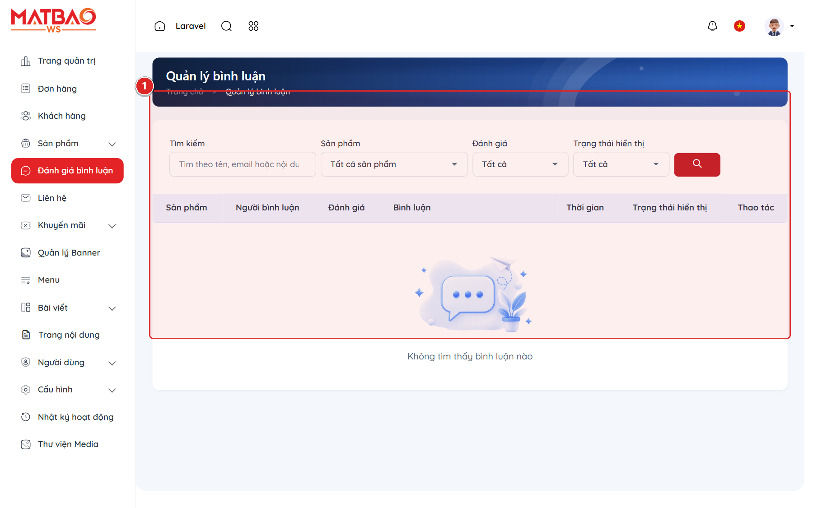

### 3. Bảng tra cứu hành động & Ký hiệu thao tác
| Ký hiệu | Khu vực / Tên trường | Hướng dẫn thao tác & Lưu ý nghiệp vụ |
| :---: | :--- | :--- |
| **①** | **Bảng kiểm duyệt đánh giá khách hàng** | Danh sách đánh giá gồm: Tên khách hàng, Sản phẩm được đánh giá, Số sao chấm, Nội dung nhận xét, Thời gian gửi và Trạng thái kiểm duyệt (Đã duyệt / Chờ duyệt). |

### 4. Lưu ý nghiệp vụ quan trọng
- 💡 **Bảo vệ uy tín thương hiệu:** Tất cả đánh giá mới từ khách hàng đều ở trạng thái Chờ duyệt theo mặc định nhằm ngăn chặn hoàn toàn việc spam liên kết hoặc bình luận ác ý từ đối thủ cạnh tranh.

---

## CHƯƠNG 11: QUẢN LÝ BANNER & CHIẾN DỊCH HÌNH ẢNH (BANNERS)

**Phân loại:** `GIAO DIỆN & TRẢI NGHIỆM` | **Đặc tả nhãn:** `branding`

**Mô tả tổng quan:** Quản lý hệ thống banner quảng cáo, slide trang chủ, banner danh mục sản phẩm và banner popup khuyến mãi của thương hiệu Winline.

### 1. Quy trình thao tác chuẩn từng bước
1. Truy cập menu 'Giao diện' &rarr; 'Banners & Sliders'.
2. Bấm nút 'Thêm Banner mới'.
3. Tải ảnh banner đúng kích thước tiêu chuẩn (khuyên dùng 1920x600px cho slide chính).
4. Cài đặt tiêu đề, liên kết đích (URL) và thứ tự hiển thị.
5. Bấm 'Lưu' để áp dụng ngay ra trang chủ.

### 2. Giao diện thực tế & Khoanh vùng chức năng (Screenshots)
> 🌐 **Đường dẫn màn hình:** `https://winline.vn/vi/admin/banners`
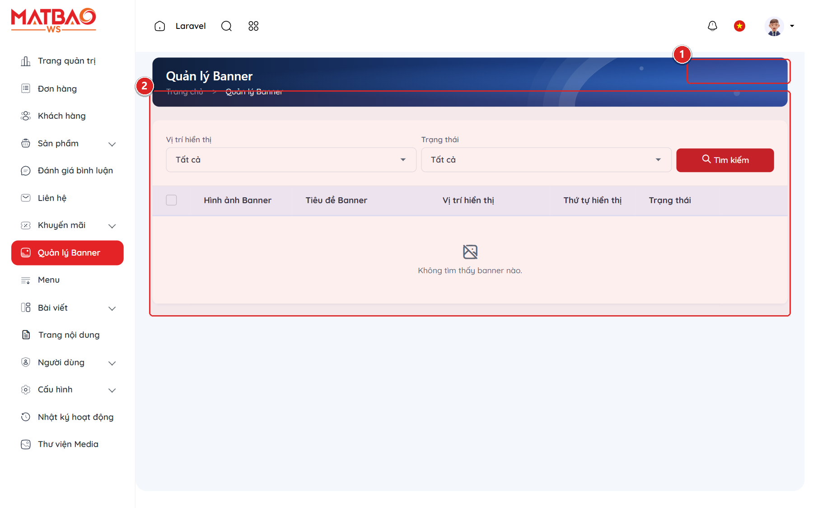

### 3. Bảng tra cứu hành động & Ký hiệu thao tác
| Ký hiệu | Khu vực / Tên trường | Hướng dẫn thao tác & Lưu ý nghiệp vụ |
| :---: | :--- | :--- |
| **①** | **Nút Thêm Banner mới** | Mở biểu mẫu tải ảnh và cấu hình liên kết điều hướng khi người dùng nhấp vào banner. |
| **②** | **Danh sách banner & Thứ tự hiển thị** | Hiển thị ảnh thu nhỏ (thumbnail), Vị trí đặt banner (Slide trang chủ, Banner chân trang, v.v.), Trạng thái kích hoạt và Số thứ tự sắp xếp. |

### 4. Lưu ý nghiệp vụ quan trọng
- 💡 **Tối ưu dung lượng hình ảnh:** Trước khi tải ảnh banner lên hệ thống, nên nén dung lượng ảnh (dưới 300KB) hoặc sử dụng định dạng WebP để website tải nhanh nhất.

---

## CHƯƠNG 12: QUẢN LÝ MENU ĐIỀU HƯỚNG WEBSITE (NAVIGATION MENUS)

**Phân loại:** `GIAO DIỆN & TRẢI NGHIỆM` | **Đặc tả nhãn:** `navigation`

**Mô tả tổng quan:** Tùy chỉnh hệ thống cây menu đa cấp: Menu chính (Header Navbar), Menu danh mục sản phẩm quạt (Mega Menu) và Menu chân trang (Footer Links).

### 1. Quy trình thao tác chuẩn từng bước
1. Truy cập menu 'Giao diện' &rarr; 'Menu điều hướng' (Menus).
2. Chọn vị trí menu cần chỉnh sửa (Menu chính hoặc Menu chân trang).
3. Thêm mục menu mới hoặc kéo thả để thay đổi vị trí phân cấp cha - con.
4. Bấm 'Lưu cây menu' để cập nhật giao diện điều hướng.

### 2. Giao diện thực tế & Khoanh vùng chức năng (Screenshots)
> 🌐 **Đường dẫn màn hình:** `https://winline.vn/vi/admin/menus`
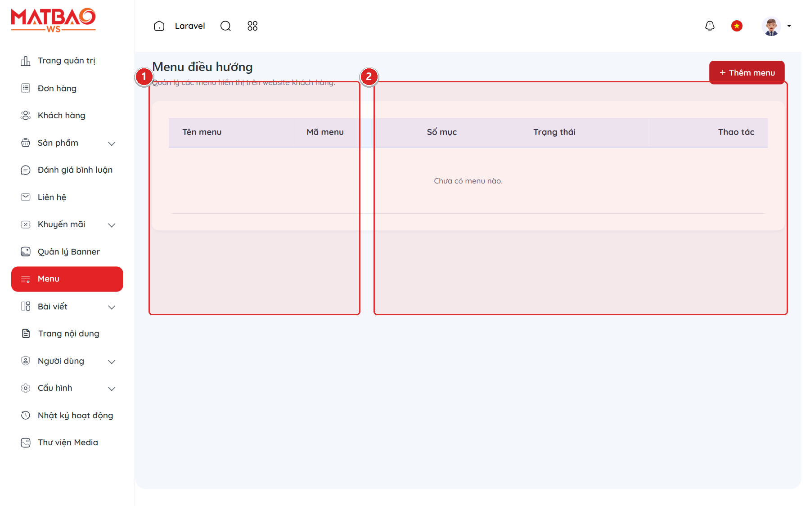

### 3. Bảng tra cứu hành động & Ký hiệu thao tác
| Ký hiệu | Khu vực / Tên trường | Hướng dẫn thao tác & Lưu ý nghiệp vụ |
| :---: | :--- | :--- |
| **①** | **Cây cấu trúc menu đa cấp** | Giao diện trực quan cho phép quan sát thứ bậc các mục menu. Kéo thả sang phải để biến thành menu con. |
| **②** | **Chi tiết mục menu** | Cấu hình Tên hiển thị (đa ngôn ngữ), Loại liên kết (Liên kết tĩnh, Danh mục sản phẩm, Bài viết hoặc URL tùy chỉnh) và Tùy chọn mở trong tab mới. |

### 4. Lưu ý nghiệp vụ quan trọng
- 💡 **Trải nghiệm tìm kiếm thiết bị:** Menu chính nên sắp xếp khoa học theo các nhóm quạt thông dụng (Quạt ly tâm, Quạt hướng trục, Quạt gắn trần, Quạt cắt gió) để khách hàng dễ dàng tìm thấy sản phẩm trong vòng 2 cú nhấp chuột.

---

## CHƯƠNG 13: THƯ VIỆN FILE & TÀI LIỆU BẢN VẼ PDF (MEDIA LIBRARY)

**Phân loại:** `NỘI DUNG & TRUYỀN THÔNG` | **Đặc tả nhãn:** `assets`

**Mô tả tổng quan:** Kho lưu trữ tập trung toàn bộ hình ảnh sản phẩm quạt, tài liệu kỹ thuật, catalogue sản phẩm PDF và hồ sơ chứng chỉ xuất xưởng CO/CQ của công ty Winline.

### 1. Quy trình thao tác chuẩn từng bước
1. Truy cập menu 'Hệ thống' &rarr; 'Thư viện Media'.
2. Bấm nút 'Tải lên' và chọn tệp tin từ máy tính hoặc kéo thả trực tiếp tệp tin vào cửa sổ trình duyệt.
3. Chọn tệp tin để sao chép đường dẫn trực tiếp (URL) hoặc chèn nhanh vào bài viết/sản phẩm.

### 2. Giao diện thực tế & Khoanh vùng chức năng (Screenshots)
> 🌐 **Đường dẫn màn hình:** `https://winline.vn/vi/admin/media`
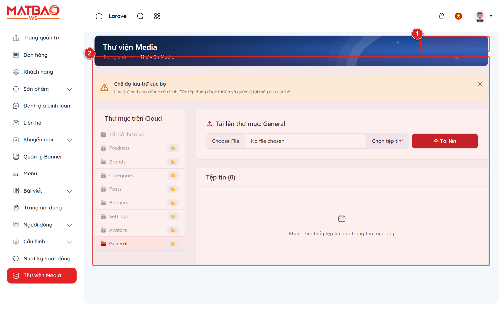

### 3. Bảng tra cứu hành động & Ký hiệu thao tác
| Ký hiệu | Khu vực / Tên trường | Hướng dẫn thao tác & Lưu ý nghiệp vụ |
| :---: | :--- | :--- |
| **①** | **Nút Tải lên tài liệu / File** | Hỗ trợ tải lên đa dạng tệp tin: ảnh (PNG, JPG, WebP, SVG) và tài liệu kỹ thuật (PDF, Excel, Word). |
| **②** | **Lưới hiển thị tệp tin phương tiện** | Hiển thị ảnh thu nhỏ, tên tệp, dung lượng file và ngày tải lên. Tích hợp tính năng tìm kiếm nhanh theo tên file. |

### 4. Lưu ý nghiệp vụ quan trọng
- 💡 **Giới hạn dung lượng tải lên:** Hệ thống hỗ trợ tải file tối đa 20MB cho mỗi tệp tin. Đối với các tài liệu catalogue kỹ thuật dung lượng lớn, nên tối ưu kích thước trước khi tải lên.

---

## CHƯƠNG 14: CÀI ĐẶT HỆ THỐNG & CỜ TÍNH NĂNG (SYSTEM SETTINGS)

**Phân loại:** `CẤU HÌNH & HỆ THỐNG` | **Đặc tả nhãn:** `configuration`

**Mô tả tổng quan:** Trung tâm cấu hình toàn diện thông tin doanh nghiệp Winline (Hotline, Email, Địa chỉ, Mã số thuế) và các cờ tính năng bật/tắt module hệ thống.

### 1. Quy trình thao tác chuẩn từng bước
1. Truy cập menu 'Cài đặt' &rarr; 'Cấu hình chung' (Settings).
2. Cập nhật thông tin công ty Winline: Tên công ty, Hotline kinh doanh, Hotline kỹ thuật, Email nhận đơn hàng, Địa chỉ kho.
3. Kiểm tra và kích hoạt các module tính năng (Giỏ hàng, Đặt hàng trực tuyến, Đa ngôn ngữ, Tỷ giá).
4. Bấm 'Lưu cấu hình' để áp dụng ngay lập tức.

### 2. Giao diện thực tế & Khoanh vùng chức năng (Screenshots)
> 🌐 **Đường dẫn màn hình:** `https://winline.vn/vi/admin/settings`
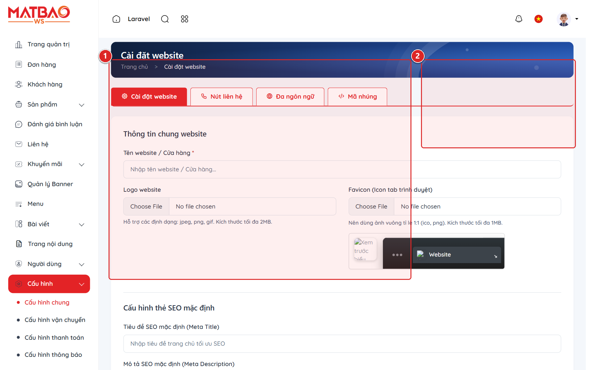

### 3. Bảng tra cứu hành động & Ký hiệu thao tác
| Ký hiệu | Khu vực / Tên trường | Hướng dẫn thao tác & Lưu ý nghiệp vụ |
| :---: | :--- | :--- |
| **①** | **Biểu mẫu thông tin thương hiệu & liên hệ** | Cấu hình tên doanh nghiệp, logo hiển thị, biểu tượng favicon, số điện thoại hotline tư vấn kỹ thuật và địa chỉ văn phòng đại diện. |
| **②** | **Cấu hình trạng thái tính năng (Feature Flags)** | Cho phép quản trị viên bật hoặc tắt nhanh các tính năng: Đặt hàng online, Đánh giá sản phẩm, Công cụ tính quạt tự động. |

### 4. Lưu ý nghiệp vụ quan trọng
- 💡 **Lưu trữ bộ nhớ đệm (Cache):** Sau khi thay đổi các thông tin cấu hình thương hiệu, hệ thống sẽ tự động làm mới bộ nhớ đệm để khách hàng thấy thông tin mới nhất ngay lập tức.

---

## CHƯƠNG 15: QUẢN LÝ ĐA NGÔN NGỮ (LOCALIZATION & LANGUAGES)

**Phân loại:** `CẤU HÌNH & HỆ THỐNG` | **Đặc tả nhãn:** `i18n`

**Mô tả tổng quan:** Cấu hình và vận hành hệ thống website đa ngôn ngữ hỗ trợ Tiếng Việt (mặc định) và Tiếng Anh phục vụ các đối tác, nhà thầu quốc tế và liên doanh.

### 1. Quy trình thao tác chuẩn từng bước
1. Truy cập menu 'Hệ thống' &rarr; 'Đa ngôn ngữ' (Languages).
2. Xem danh sách ngôn ngữ hiện có (Tiếng Việt `vi`, Tiếng Anh `en`).
3. Đặt ngôn ngữ mặc định khi khách hàng truy cập website.
4. Bật/Tắt công tắc kích hoạt cho từng ngôn ngữ.

### 2. Giao diện thực tế & Khoanh vùng chức năng (Screenshots)
> 🌐 **Đường dẫn màn hình:** `https://winline.vn/vi/admin/languages`
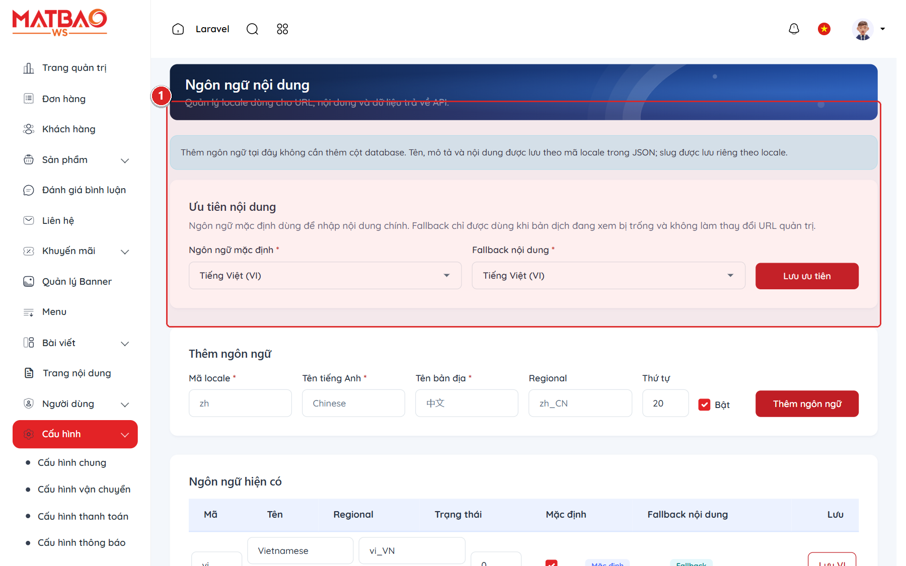

### 3. Bảng tra cứu hành động & Ký hiệu thao tác
| Ký hiệu | Khu vực / Tên trường | Hướng dẫn thao tác & Lưu ý nghiệp vụ |
| :---: | :--- | :--- |
| **①** | **Bảng danh sách ngôn ngữ hệ thống** | Hiển thị Tên ngôn ngữ, Mã ngôn ngữ (vi / en), Biểu tượng quốc kỳ, Trạng thái hoạt động và Ngôn ngữ được chọn làm mặc định. |

### 4. Lưu ý nghiệp vụ quan trọng
- 💡 **Nhập liệu song ngữ:** Khi tính năng đa ngôn ngữ được kích hoạt, các form nhập liệu Sản phẩm và Bài viết sẽ có thêm các tab tương ứng cho Tiếng Việt và Tiếng Anh để biên dịch nội dung.

---

## CHƯƠNG 16: NHẬT KÝ KIỂM TOÁN & TRUY VẾT BẢO MẬT (ACTIVITY LOGS)

**Phân loại:** `CẤU HÌNH & HỆ THỐNG` | **Đặc tả nhãn:** `security audit`

**Mô tả tổng quan:** Hệ thống ghi nhận nhật ký truy vết chi tiết mọi hành vi quản trị viên nhằm bảo đảm an toàn dữ liệu, chống gian lận và phục vụ đối soát nội bộ.

### 1. Quy trình thao tác chuẩn từng bước
1. Truy cập menu 'Hệ thống' &rarr; 'Nhật ký hoạt động' (Activity Logs).
2. Xem danh sách các sự kiện thao tác được sắp xếp theo trình tự thời gian mới nhất.
3. Lọc sự kiện theo tài khoản quản trị viên hoặc theo hành động (Tạo mới, Cập nhật, Xóa, Đăng nhập).
4. Bấm vào chi tiết để xem sự khác biệt dữ liệu trước và sau khi thay đổi (Diff Inspection).

### 2. Giao diện thực tế & Khoanh vùng chức năng (Screenshots)
> 🌐 **Đường dẫn màn hình:** `https://winline.vn/vi/admin/activity-logs`
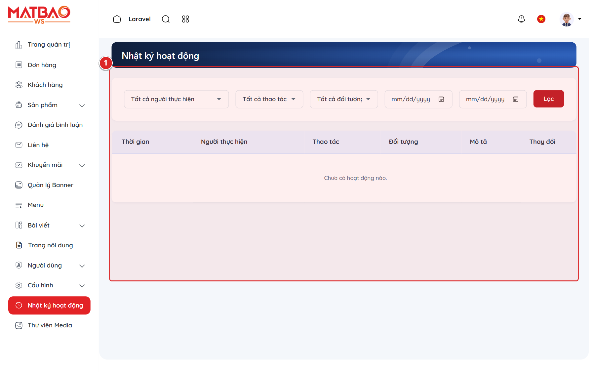

### 3. Bảng tra cứu hành động & Ký hiệu thao tác
| Ký hiệu | Khu vực / Tên trường | Hướng dẫn thao tác & Lưu ý nghiệp vụ |
| :---: | :--- | :--- |
| **①** | **Bảng nhật ký kiểm toán quản trị** | Bao gồm: Mốc thời gian chính xác, Tài khoản thực hiện, Địa chỉ IP truy cập, Đối tượng dữ liệu bị tác động và Hành động cụ thể. |

### 4. Lưu ý nghiệp vụ quan trọng
- 💡 **Không thể xóa sửa nhật ký:** Dữ liệu nhật ký kiểm toán được bảo vệ nghiêm ngặt ở mức kiến trúc hệ thống và không cho phép bất kỳ quản trị viên nào chỉnh sửa hoặc xóa nhằm bảo đảm tính minh bạch tuyệt đối.

---

## CHƯƠNG 17: CÔNG CỤ TÍNH TOÁN LƯU LƯỢNG QUẠT STOREFRONT (HVAC CALCULATOR)

**Phân loại:** `CÔNG CỤ KỸ THUẬT HVAC` | **Đặc tả nhãn:** `hvac algorithm`

**Mô tả tổng quan:** Bộ công cụ tính toán tự động lưu lượng thông gió nhà xưởng, văn phòng, tầng hầm và đề xuất chính xác các model quạt Winline đáp ứng tiêu chuẩn kỹ thuật.

### 1. Quy trình thao tác chuẩn từng bước
1. Truy cập đường dẫn công cụ ngoài website: `http://winline.vn/vi/cong-cu-tinh-toan-chon-quat`.
2. Nhập các thông số hình học của công trình: Chiều dài ($m$), Chiều rộng ($m$), Chiều cao ($m$).
3. Chọn Loại hình không gian (Nhà xưởng cơ khí, May mặc, Tầng hầm tòa nhà, Bếp ăn công nghiệp) để hệ thống tự động gán hệ số bội số trao đổi khí ($lần/giờ$).
4. Bấm 'Tính toán & Chọn quạt phù hợp' để nhận kết quả tức thì.

### 2. Giao diện thực tế & Khoanh vùng chức năng (Screenshots)
> 🌐 **Đường dẫn màn hình:** `https://winline.vn/vi/cong-cu-tinh-toan-chon-quat`
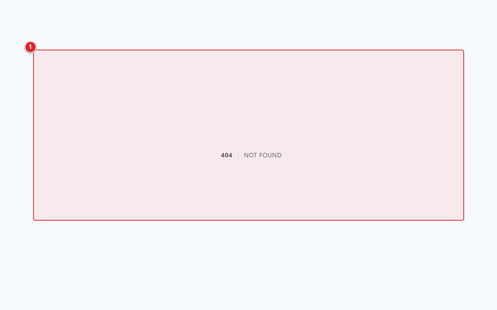

### 3. Bảng tra cứu hành động & Ký hiệu thao tác
| Ký hiệu | Khu vực / Tên trường | Hướng dẫn thao tác & Lưu ý nghiệp vụ |
| :---: | :--- | :--- |
| **①** | **Biểu mẫu nhập thông số công trình & Bảng kết quả** | Khu vực nhập liệu kích thước phòng ($D \times R \times C$), tính ra thể tích $V = D \times R \times C$ ($m^3$). Tự động nhân với bội số trao đổi khí để ra Tổng lưu lượng yêu cầu $Q_{yc} = V \times X$ ($m^3/h$). Hệ thống đề xuất danh sách quạt Winline có lưu lượng phù hợp nhất kèm nút Xem chi tiết và Yêu cầu báo giá. |

### 4. Lưu ý nghiệp vụ quan trọng
- 💡 **Công thức chuẩn kỹ thuật HVAC:** Thuật toán vận hành dựa trên Tiêu chuẩn Xây dựng Việt Nam (TCVN) và tài liệu thiết kế cơ điện. Dữ liệu quạt đề xuất được đồng bộ trực tiếp từ danh mục quạt công nghiệp trong trang quản trị Winline.

---
